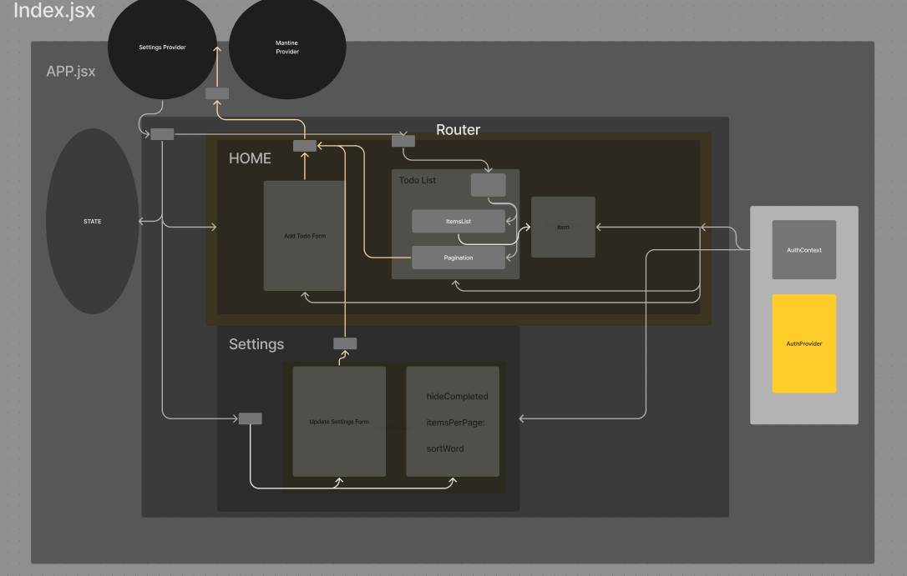

# Todo Context

Use the context API and various hooks to create a Todo App

## Author: Ethan Storm

## Collaboration: Code Fellows LAB-31, 32, 33

### Resources and Links

- [lab 31 sandbox](https://codesandbox.io/p/github/ShadowDraco/todo-context/main?workspaceId=a3383399-bf2b-4cb1-9efa-c698b2303ac8)
- 
- 

## Learning Outcomes

- Learn React context functionality and gain overall React fluency.
- Gain proficiency in reading documentation by using a new component library.
- Practice JavaScript array manipulation by implementing pagination.
- Gain React testing fluency.

## Phase 1 Requirements

In Phase 1, we're going to perform some refactoring of a Todo application built by another team.

- Properly modularize the application into separate components, note the **proposed** file structure below.
- Implement the Context API to make some basic application settings available to components.
- Style the application using the [Mantine Component API](https://mantine.dev/pages/getting-started/)

## Phase 2

In Phase 2, we allow the user to make some decisions on how they would like the application to function. Specifically, we’ll let them make changes to 2 settings.

Implement the Context API to make some basic application settings available to components.
Save the users choices in Local Storage.
Retrieve their preferences from Local Storage and apply them to the application on startup.

## Phase 3 Requirements

In Phase 3, we require users be logged in to view items and also restrict access based on user type.

- This is an inclusion of user stories based on current features

  - As a user, I want to provide a way for other users to create new accounts.
  - As a user, I want to provide a way for all users to login to their account.
  - As a user, I want to make sure that my To Do items are only viewable to users that have - logged in with a valid account.
  - As a user, I want to ensure that only fellow users that are allowed to “create”, based - on their user type, can add new To Do Items.
  - As a user, I want to ensure that only fellow users that are allowed to “update”, based - on their user type, can mark To Do Items complete.
  - As a user, I want to ensure that only fellow users that are allowed to “delete”, based on their user type, can delete new To Do Items.
