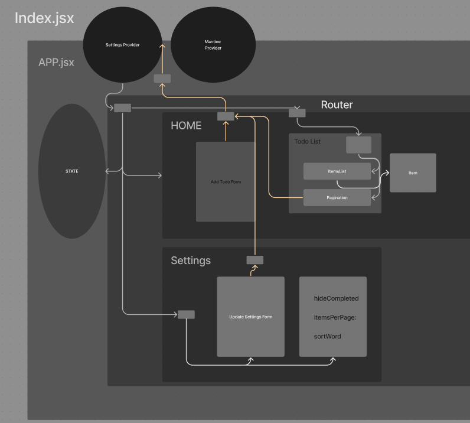

# Todo Context

Use the context API and various hooks to create a Todo App

## Author: Ethan Storm

## Collaboration: Code Fellows LAB-31

### Resources and Links

- [lab 31 sandbox](https://codesandbox.io/p/github/ShadowDraco/todo-context/main?workspaceId=a3383399-bf2b-4cb1-9efa-c698b2303ac8)
- 

## Learning Outcomes

- Learn React context functionality and gain overall React fluency.
- Gain proficiency in reading documentation by using a new component library.
- Practice JavaScript array manipulation by implementing pagination.
- Gain React testing fluency.

## Phase 1 Requirements

In Phase 1, we're going to perform some refactoring of a Todo application built by another team.

- Properly modularize the application into separate components, note the **proposed** file structure below.
- Implement the Context API to make some basic application settings available to components.
- Style the application using the [Mantine Component API](https://mantine.dev/pages/getting-started/)

In Phase 2, we’re going to extend the functionality of our application by allowing the user to make some decisions on how they would like the application to function. Specifically, we’ll let them make changes to 2 settings.

Implement the Context API to make some basic application settings available to components.
Save the users choices in Local Storage.
Retrieve their preferences from Local Storage and apply them to the application on startup.
